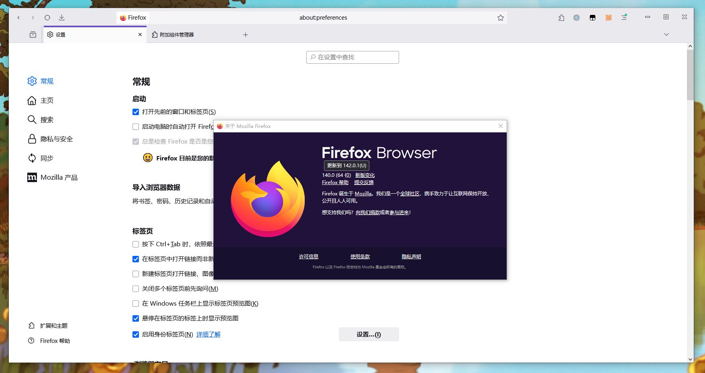

# Simplifoxify

My personal firefox css theme focused on simpleness.

## Install

1. Goto `about:profile` and open the profile folder.

2. Copy `user.js` and `chrome` to the profile folder.

3. Restart Firefox.

## Enable Live Editing (For Developer)

1. Press `F12` to open web developer console.

2. Go to `setting` of web developer console, turn on `Enable browser interface and addon debug toolkit` and `Enable remote debug`.

3. Goto `Menu -> Tools -> Browser toolkit` or `Ctrl+Shift+Alt+I`.

4. Accept remote debug connection.

5. Goto `Style` tab, search for `userChrome.js`. Edit the content and wait for few seconds to update in the interface of browser.